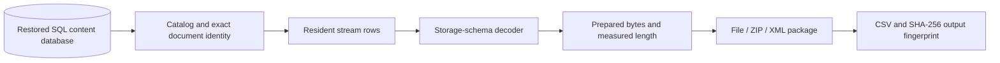

<div align="center">


# SharePoint DB Explorer

**Browse a restored SharePoint content database and export its documents, without a SharePoint farm.**


</div>

SharePoint DB Explorer is a Windows desktop application for reading a SharePoint content database restored on SQL Server. Browse sites, subsites, libraries, lists and folders, then recover documents, retained versions, deleted content and list attachments to disk. Export entire libraries or folders as ZIP archives, or generate XML content-deployment packages.

The application reads SQL metadata and stored content directly through `Microsoft.Data.SqlClient`. It does not modify the source database or require a SharePoint server, SharePoint API, or SharePoint runtime. Its recovery library reconstructs supported file representations from resident SQL bytes; it does not simply concatenate database rows.

Use a restored, online copy of a database that you are authorized to access. This is the intended recovery workflow; Microsoft's [database support policy](https://learn.microsoft.com/en-us/troubleshoot/sharepoint/administration/unsupported-and-supported-sharepoint-database-changes) explains the support and locking implications of direct reads from production SharePoint databases.

## Contents

- [Features](#features)
- [Requirements](#requirements)
- [Download and install](#download-and-install)
- [Using the app](#using-the-app)
- [How it works](#how-it-works)
- [Build from source](#build-from-source)
- [Run the checks](#run-the-checks)
- [Project structure](#project-structure)
- [Limitations](#limitations)
- [Contributing and security](#contributing-and-security)
- [License](#license)
- [Format references](#format-references)

## Features

| Feature | Current behavior |
|---|---|
| Database connection | Enter your SQL Server or instance, choose Windows or SQL authentication, load accessible databases, then select a content database |
| Browsing | Navigate a tree of sites, subsites, libraries, lists and folders; inspect items in the right pane |
| Checked-file export | Export checked files in the current folder to a chosen directory or ZIP |
| Library and folder export | Export an entire current library to disk; save a whole library or folder, including nested files, as ZIP |
| Document versions | Browse a document's retained versions and export one; export all retained versions of checked documents in a batch |
| Deleted content | Browse retained deleted records, recover their documents and versions, and save retained deleted list-item metadata as XML |
| List attachments | Export one ordinary list item's attachments, or export all attachments in an ordinary list grouped by item ID |
| OneNote | Convert supported section and notebook-index cells to `.one` and `.onetoc2` alternative packages |
| XML packages | Generate an uncompressed content-deployment package for a current list or library, optionally including retained item/document history; target-farm import remains unverified |
| Reports | Record export results, paths, recovered byte counts and SHA-256 checksums in CSV; ZIPs contain their report and summary |
| Desktop interactions | Clear file selections on navigation, perform SQL/export work in the background, report progress, and support cancellation and keyboard navigation |

Known metadata-only templates and unsupported storage-schema values are excluded from file selections and bulk file export. They do not produce a batch of warnings about default forms such as `DispForm.aspx` or `EditForm.aspx`. Content problems discovered while reading an eligible file still appear in the result/report.

## Requirements

| Requirement | Details |
|---|---|
| Operating system | Windows 10 build 19041 or later, x64; Windows 11 x64 |
| Database | SharePoint Server 2016, 2019 or Subscription Edition content database, restored and online on SQL Server |
| Database access | A login that can read the required tables and metadata, such as `db_datareader`; database discovery connects to `master` |
| Connectivity | Access from this PC to the SQL Server instance |
| Output storage | A writable destination with enough free space for recovered files and temporary output |

Subscription Edition has been exercised against a restored database. The 2016/2019 schema variants are covered by synthetic compatibility checks; they do not have the same real-database validation coverage. Generation detection reads the database's `dbo.Versions` build value. SharePoint 2013 and earlier databases are rejected. Optional columns such as `SizeRead`, `SizeWrite`, `CompressedSize` and `ABSId` are queried only when available.

Ready-to-run packages include the .NET and Windows App SDK runtime files. An SDK or Visual Studio installation is needed only to build from source.

## Download and install

The repository includes ready-to-run **v1.0.0** packages:

| Download | Use |
|---|---|
| [Installer ZIP](releases/v1.0.0/SharePointDatabaseExplorerInstaller-v1.0.0-win-x64.zip) | Recommended installer download; includes both required installer files |
| [setup.exe](releases/v1.0.0/setup.exe) and [MSI](releases/v1.0.0/SharePointDatabaseExplorerSetup.msi) | The same installer as separate files; keep both in the same directory |
| [Portable ZIP](releases/v1.0.0/SharePointDatabaseExplorer-v1.0.0-win-x64.zip) | Complete application folder; extract and run without installation |
| [SHA256SUMS.txt](releases/v1.0.0/SHA256SUMS.txt) | SHA-256 checksums for all four binary downloads |

Open a download link and use GitHub's **Download raw file** button to save the binary. Future packaged versions live under [`releases/`](releases). Assets uploaded by the maintainer also appear on the [GitHub Releases page](https://github.com/olgaczaim/SharePoint-DB-Explorer/releases).

### Installer

1. Download and extract the **Installer ZIP**.
2. Run **`setup.exe`** from the extracted directory. The launcher requires `SharePointDatabaseExplorerSetup.msi` beside it.
3. Complete the installation wizard. The default installation directory is `C:\Program Files\SharePoint Database Explorer`; the desktop and Start menu shortcuts are named **SharePoint Exporter**.
4. Launch the app from a shortcut.

Uninstall through Windows **Installed apps** or **Programs and Features**. A newer installer version is configured to remove the previous installed version.

### Portable application

1. Download the **Portable ZIP**.
2. Extract the whole archive to a directory of your choice.
3. Run **`SharePointExplorer.Desktop.exe`** there.

Keep its DLLs, runtime files, icon and resource directories together. Copying the EXE alone does not deploy the application.

### Verify the package

```powershell
Get-FileHash .\SharePointDatabaseExplorer-v1.0.0-win-x64.zip -Algorithm SHA256
```

Compare the result with the corresponding line in `SHA256SUMS.txt`. The binaries are not code-signed; use the supplied checksum and source when assessing a download.

## Using the app

1. **Connect.** The server and database fields start empty. Enter a SQL Server name or instance and choose **Windows authentication** for the current Windows account, or **SQL authentication** with a username and password. Click **Load databases**, select your restored content database, then **Connect**. You can also type the database name directly. Passwords remain in memory and are not saved as application settings.
2. **Browse.** Expand sites and subsites in the left tree, then choose a library, list or folder. Double-click a folder in the right pane to open it. Select a row to view its details.
3. **Check files.** Check individual files or use **Select all files** for exportable files in the current folder. Changing folders clears the checks. A highlighted row and a checked file serve different actions: **Versions** uses the selected document row; **Export selected** uses the checkboxes.
4. **Export files.** Choose **Export selected** and a destination folder, or **Save ZIP** and an archive filename. Use **Export library** for all current files in the current library, including nested folders. **More > Save entire library as ZIP** and **More > Save this folder as ZIP** export those complete scopes to an archive.
5. **Recover versions.** Select a document row, click **Versions**, choose a retained version, then export it. For several documents, check them and choose **More > Export all versions of checked files**. Recovery uses each selected version's own storage identity.
6. **Recover deleted content.** Open **Deleted items** beneath a site to browse retained deleted records. Check deleted documents to export them, or select a deleted list-item row and choose **More > Recover deleted list item metadata**. Its XML preserves retained field data; it is not a complete content-deployment package.
7. **Export attachments.** Select an ordinary list item and choose **More > Export item attachments**, or select its list and use **More > Export list attachments**.
8. **Generate an XML package.** Select a current list or library and choose **More > Export XML package**, or **Export XML package with version history**. The output follows the uncompressed content-deployment format used by `Import-SPWeb -NoFileCompression`; importing it into a target farm has not been verified. Review [package scope and limits](#content-deployment-xml-packages) before relying on this operation for migration.

The connection dialog exposes encryption and certificate-trust options. Currently, both **Encrypt** and **Trust server certificate** default to enabled. Disable certificate trust when your SQL Server presents a certificate that the client can validate.

### Where exported content goes

| Operation | Output layout |
|---|---|
| Export selected | Files directly in your chosen folder, beside a uniquely named CSV report |
| Export one version | A version-labelled filename such as `Report (v1.0).docx`, directly in the chosen folder |
| Export library / deleted documents / batch versions | Site-ID and source-path subdirectories preserve document hierarchy |
| ZIP export | Site-ID and source-path entries, plus `export-report.csv` and `summary.txt` |
| One item's attachments | Files directly in the chosen folder |
| Whole-list attachments | One subdirectory per numeric item ID, plus a CSV report |
| XML package | A uniquely named package subdirectory containing XML, payloads, audit data and an export report |

File names and paths are sanitized. Existing exported files are not overwritten: collisions receive numbered names such as `Report (2).docx`.

### Progress, cancellation and troubleshooting

File batches report each processed document and continue after an individual recovery failure. Cancelling a file batch stops between documents and preserves files already completed. A cancelled ZIP batch can publish the successfully recovered entries with its cancellation summary; an archive whose creation/copy fails is discarded. XML packages are published only after validation: cancellation or validation failure removes the temporary package instead of publishing a partial package.

Storage warnings, including damaged row data skipped during reconstruction, are written to:

```text
%LOCALAPPDATA%\SharePointExplorer\Logs\SharePointExplorer-yyyyMMdd.log
```

Consult the CSV's `ExportPath` for the exact filename and the `Status`/`Message` fields for failures. Export reports describe recovered content; they are not a complete inventory of templates or formats excluded before recovery.

**Keyboard:** <kbd>Enter</kbd> opens the selected folder, <kbd>Space</kbd> toggles the selected file's checkbox, <kbd>F5</kbd> refreshes, and <kbd>Alt</kbd>+<kbd>Up</kbd> navigates to the parent.

## How it works

The full technical description is in [docs/Architecture.md](docs/Architecture.md), including decoder boundaries, SQL identities, chunk-state rules, damage handling and publication checks.

### Recovery pipeline



The storage layer reads metadata and resident bytes using parameterized queries. The decoder layer understands the stored representation. The recovery engine binds those two layers and prepares output; export services sanitize paths, write temporary files and publish completed results. WinUI view models coordinate navigation, selection and background operations.

### Metadata and SQL stream identity

| Tables | Purpose |
|---|---|
| `Sites`, `Webs` | Site collections and subsites |
| `AllLists`, `AllUserData` | Libraries, lists, list items and field data |
| `AllDocs` | Current documents/folders, paths, versions and stream-schema metadata |
| `AllDocVersions` | Retained document-version metadata |
| `DocsToStreams`, `DocStreams` | Mappings from a version to its stored stream bytes |
| `RecycleBin` | Retained deletion metadata associated with deletion transactions |
| `UserInfo`, `AllWebParts` | Referenced users and public views for XML packages |
| `Versions` | Source database build and generation detection |

Stream retrieval uses the selected site's ID, document ID, publishing level and history-version number. The current document uses history version `0`; a historical document uses its retained history identity. Only partition `0` is read. The SQL `BSN` associates physical rows, but does not decide the logical order of file bytes.

Deleted recovery also validates the binary deletion transaction before and after stream reading. Historical/deleted requests cannot silently fall back to the current document. Attachment recovery validates the owning list item and its attachment document.

Files with `HasStream = 0` have no supported resident file stream; common examples are default, uncustomized library forms whose bytes live in a SharePoint template. Those server-template bytes are not fabricated. Nonempty remote BLOB references require an external provider that this application does not currently implement.

### Decoder selection

`AllDocs.StreamSchema` describes the storage representation, rather than the file extension. The registry accepts defined file/cell/host flags and rejects reserved or unknown combinations.

| `StreamSchema` | Representation |
|---|---|
| `0`, `1`, `64`, `65` | Plain resident stream; exact inline length is required |
| `2`, `66` | Generic shredded document tree |
| `18`, `82` | OneNote section cell |
| `34`, `98` | OneNote notebook-index cell |
| Other values | Unsupported by the current decoder registry |

Physical resident chunks are checked against their SQL chunk lengths before decoding. Available resident bytes are retained when external compression metadata describes an external replacement; unknown compression contexts are rejected instead of being guessed.

### Reconstructing shredded files and split objects

A generic file is a graph of stored objects: nodes contain ordered references, and leaves contain the file's byte segments. One SQL row can hold many objects, and one object can be split across several rows. Concatenating rows or sorting them by SQL `BSN` would produce incorrect output.

[`PersistedStorage.cs`](src/Serialization/PersistedStorage.cs) parses host-blob elements, signatures, GUID tables and contained data-element blobs. [`ShreddedStore.cs`](src/Serialization/ShreddedStore.cs) interprets revisions, object groups and fragments. [`GenericDocumentStore.cs`](src/Serialization/GenericDocumentStore.cs) maintains object states, and [`StoredDocumentReader.cs`](src/Serialization/StoredDocumentReader.cs) walks the logical file tree.

The current generic reconstruction rules are:

1. **Read order.** Parse the first main row (`StreamId = 1`) first, then non-main rows in source delivery order. Additional main rows are ignored. Parse fields structurally; do not search for byte signatures inside arbitrary payloads.
2. **Identity tables and root.** GUID tables resolve compressed object identities. The last processed revision manifest that declares the primary file root chooses that root; SQL row sequence and stored index/base-revision links do not override it.
3. **Independent states.** Inline records with references become nodes; records without references become leaves. Partial records become leaf fragments even when their header lists references. Nodes and leaves keep independent state; a node takes precedence when both share an identity.
4. **Inline updates.** A strictly newer embedded sequence replaces an older inline state of the same kind. Equal sequence numbers retain the first-read inline state.
5. **Partial updates.** A leaf's first accepted state establishes a sequence threshold. Fragments at or above that threshold are accepted across groups, without advancing the threshold. A later accepted inline state can raise it, but existing fragments remain preferred over inline bytes. Direct object-data BLOB fragments use their own fragment identity/serial sequence; resident BLOB references are a fallback when an object has no inline or partial leaf.
6. **Split-object bytes.** Sort accepted fragments by start offset; at duplicate starts, the last accepted fragment wins. Append each distinct-start fragment's full bytes, including overlap. A start beyond the accumulated output leaves a gap and fails. Declared fragment spans do not trim this generic output.
7. **Logical traversal.** Starting at the chosen root, follow references in order, depth-first, and append each leaf's reconstructed bytes. Missing required objects, cycles, repeated consumption of a leaf and traversal-budget violations fail recovery.
8. **Measured result.** Keep the result as ordered segments into the stored buffers and measure that reconstructed length. Generic output is not bounded by stored node sizes, SQL logical size or stored leaf hashes. Plain-stream length checks and OneNote's own packaging checks are separate rules.

If a row has broken structure, successfully parsed records before the damage can remain available, the unread remainder is skipped and a storage warning is logged. Missing required structure still fails recovery. This tolerance is not proof that a damaged source is complete.

### OneNote output

The OneNote writer converts supported SharePoint section/index cells into the alternative packaging format documented by [MS-ONESTORE]. It collects the storage index, manifests, revisions and object groups, reassembles supported fragmented groups, checks required references, then writes the synthesized `.one` or `.onetoc2` file. Its output size can differ from SQL's logical size.

Resident plain-stream OneNote files use the ordinary plain decoder. The specialized cell writer does not support OneNote objects backed by separate object-data BLOBs, and does not create a complete notebook `.onepkg` archive. Universal compatibility with every native notebook layout has not been established.

### Output integrity and publication

- The recovery engine prepares document content and determines the output length before publication.
- File export writes a temporary file, verifies the written length against the prepared length, then moves it to an available final filename.
- ZIP export first recovers each document to a temporary spool file and checks its length. It copies that file into an archive entry, adds the report/summary, closes and flushes the archive, then moves the temporary ZIP to its final name. It does not perform a complete ZIP read-back verification before publication.
- SHA-256 is computed over recovered file bytes and recorded in reports. It is an output fingerprint; comparison with an independently known original hash is needed to prove byte equality with that original.
- Stored chunks of the active document remain in memory during recovery. Very large documents therefore require corresponding free memory; ZIP export additionally uses temporary disk space.

### Content-deployment XML packages

[`MigrationPackageExporter.cs`](src/Export/MigrationPackageExporter.cs) produces deployment XML and recovered payload files for a current list or library. Supported metadata includes typed field values, content types, referenced users, public views, current items, document folders and attachments. The history option adds retained item and document versions.

The exporter validates XML against the bundled [deployment schemas](src/Export/Schemas/README.md), checks payload/reference consistency, and re-reads source metadata to detect changes before publishing the package directory. Known template files are represented through target-template metadata; their absent original bytes are not supplied. Unsupported metadata serializers or required content failures stop package creation rather than publish a package that quietly omits them.

Permissions, workflows and running-state recovery are excluded. A target would also need compatible list templates, fields and dependencies. The package aims at the uncompressed [content-deployment format](https://learn.microsoft.com/en-us/openspecs/sharepoint_protocols/ms-primepf/ed939296-b69e-4a4f-a5f7-5f776c8e59ff), but schema validation does not establish a successful `Import-SPWeb` round trip. Test imports on a separate target before using packages for migration.

## Build from source

### Prerequisites

| Tool | Required for |
|---|---|
| Windows x64, build 19041 or later | Desktop build and execution |
| [.NET 10 SDK](https://dotnet.microsoft.com/download/dotnet/10.0) | CLI build, publish and checks |
| [Git](https://git-scm.com/) | Cloning and release source tracking |
| Visual Studio supporting .NET 10, such as [Visual Studio 2026](https://visualstudio.microsoft.com/), with **.NET desktop development** | Optional IDE editing/debugging; required by the existing installer creator |
| [Visual Studio Installer Projects extension](https://marketplace.visualstudio.com/items?itemName=VisualStudioClient.MicrosoftVisualStudio2022InstallerProjects) | MSI/setup.exe build only; the extension supports Visual Studio 2026 |

[`global.json`](global.json) requires a stable `.NET 10` SDK starting from `10.0.100`, using `latestFeature` roll-forward within that major/minor version. A newer .NET major alone does not satisfy it. NuGet dependencies are pinned by the three project-specific `*.packages.lock.json` files.

### Step by step in PowerShell

1. **Clone and enter the repository.**

   ```powershell
   git clone https://github.com/olgaczaim/SharePoint-DB-Explorer.git
   Set-Location SharePoint-DB-Explorer
   ```

2. **Confirm the SDK is installed.**

   ```powershell
   dotnet --list-sdks
   dotnet --version
   ```

   Run the commands from the repository so `global.json` participates in SDK selection.

3. **Restore the desktop app and test runner using the lock files.** First restore requires access to the configured NuGet source.

   ```powershell
   dotnet restore SharePointExplorer.Desktop.csproj --locked-mode -p:Platform=x64
   dotnet restore SharePointExplorer.Modern.Tests.csproj --locked-mode
   ```

4. **Build the desktop app.**

   ```powershell
   dotnet build SharePointExplorer.Desktop.csproj -c Release -p:Platform=x64 --no-restore
   ```

5. **Publish the complete, runnable application.**

   ```powershell
   dotnet publish SharePointExplorer.Desktop.csproj -c Release -p:Platform=x64 --no-restore --output bin\Desktop
   ```

6. **Launch it.**

   ```powershell
   .\bin\Desktop\SharePointExplorer.Desktop.exe
   ```

Copy the entire `bin\Desktop` folder to deploy this build to another supported PC. The application uses an unpackaged, self-contained WinUI deployment; it is not a single-file EXE.

[`Directory.Build.props`](Directory.Build.props) places ordinary build output under `.scratch\build\`, the NuGet cache under `.scratch\nuget\packages`, and intermediate project files under `obj\`. These generated directories are ignored by Git.

**Visual Studio:** open `SharePointExplorer.sln`, choose **Release | x64**, set **SharePointExplorer.Desktop** as the startup project, then run it. Without the Installer Projects extension the desktop app can still be built by its `.csproj` using the CLI commands above.

**VS Code:** **Terminal > Run Task > Build SharePoint Explorer** publishes to `bin\Desktop`; **Run SharePoint Explorer Desktop** launches that output. Shared tasks are in [`.vscode/tasks.json`](.vscode/tasks.json).

## Run the checks

The test project is a custom console runner, not a `dotnet test` test-adapter project. It reports `PASS` lines and returns a nonzero exit code on failure.

```powershell
# Synthetic/local recovery, export and interaction checks; no SQL database required.
dotnet run --project SharePointExplorer.Modern.Tests.csproj -c Release --no-restore

# Native WinUI control checks; publish to bin\Desktop first.
dotnet run --project SharePointExplorer.Modern.Tests.csproj -c Release --no-restore -- --native
```

Local fixtures cover schema dispatch, resident bytes/compression context, generic graphs, split objects, fragments, resident object-data BLOBs, OneNote packaging, damaged rows, export publication, ZIPs, reports, version identities, cancellation and view models. See [`tests/StorageFixture.cs`](tests/StorageFixture.cs) and [`GenericReaderRuleChecks.cs`](tests/Modern/GenericReaderRuleChecks.cs). Synthetic coverage is not a guarantee for every storage layout in arbitrary backups.

Optional database modes:

```powershell
dotnet run --project SharePointExplorer.Modern.Tests.csproj -c Release --no-restore -- --integration
dotnet run --project SharePointExplorer.Modern.Tests.csproj -c Release --no-restore -- --migration-integration
dotnet run --project SharePointExplorer.Modern.Tests.csproj -c Release --no-restore -- --package-history-integration
```

These modes currently use Windows authentication to the maintainer's lab server `SQL`, database `WSS_Content`, and fixed fixture identities/content expectations. They are not configurable acceptance checks for an arbitrary database; adapt the fixtures before using them elsewhere. Passing `--native` together with `--integration` or `--migration-integration` also runs the native integration diagnostics. Test output and logs go under `.scratch\`.

## Create and publish a release

The project retains its existing [Visual Studio Installer project](installer/Installer.vdproj). The [Installer publish profile](Properties/PublishProfiles/Installer.pubxml) supplies a self-contained application folder to that creator. Release configuration produces `setup.exe` and its matching MSI.

5. If you also want repository download links, commit and push the generated `releases\v<version>` folder **after the release upload**. The release tag still identifies the source commit used for the build.

Do not commit new binaries between building and uploading: that changes `HEAD`, so the compiled-commit check rejects them until rebuilt. Committing downloadable files to the repository and uploading a GitHub Release are separate actions.

The repository is taken from the GitHub `origin` remote; use `-Repository owner/repository` to specify it explicitly. Authentication uses `GH_TOKEN`/`GITHUB_TOKEN` or the existing Git for Windows credential helper. The token needs repository **Contents: read and write** permission; it is not written to project files.

The uploader verifies package hashes and the application assembly's compiled commit identity before contacting GitHub. A new release starts as a draft, receives all five assets, and is published only after uploads succeed. An existing version requires an explicit `-ReplaceAssets` option, or a new version. To opt into uploading from the Visual Studio post-build hook, set `SHAREPOINT_RELEASE_UPLOAD=1` in that Visual Studio process's environment; the same source/commit checks apply.

The included v1.0.0 packages can be downloaded as supplied. Rebuild from your own current committed checkout before using the uploader to associate packages with that checkout's release tag.

## Project structure

```text
SharePoint-DB-Explorer/
  src/
    Core/             Recovery engine, sessions, models, checksums and logging
    Storage/          SQL catalog, version/deletion/attachment identities and chunks
    Serialization/    Plain, generic shredded and OneNote decoders
    Export/           File, ZIP, reports and content-deployment writers
      Schemas/        Deployment XML schemas and attribution
    Desktop/          Controller and UI-independent view models
    WinUI/            Windows, dialogs, assets and native diagnostics
  tests/              Console runner and synthetic/lab checks
  docs/               Technical architecture
  installer/          Existing Visual Studio Installer project and icon
  tools/              Release packaging and upload scripts
  releases/           Installer and portable downloads, organized by version
  Properties/         Publish profile
  SharePointExplorer.sln
  SharePointExplorer.Recovery.csproj
  SharePointExplorer.Desktop.csproj
  SharePointExplorer.Modern.Tests.csproj
  LICENSE
```

## Limitations

- Recovery requires the database to be restored and online in SQL Server; the app does not open `.bak`, `.mdf`, backup-chain or log files directly.
- External RBS/ABS/provider content is unavailable when no supported resident bytes remain; there is no external-store reader.
- Purged documents/versions and absent server-template bytes cannot be recovered from metadata alone.
- SharePoint 2016/2019 coverage is based on emulated schemas. Older generations and unknown schema variants are rejected.
- OneNote conversion supports a subset of cell storage. Separate object-data BLOBs within native OneNote cells and `.onepkg` notebook assembly are not implemented.
- XML packages exclude permissions/workflows, reject unsupported metadata serializers, and have no verified target-farm import round trip.
- Generic reconstruction uses its stored tree/state rules and measured output. It does not validate stored leaf hashes or force SQL logical-size equality; use an independent original checksum when available.
- Chunks of the document being recovered are held in memory. Large documents and temporary ZIP spools need sufficient memory/disk capacity.
- Search, direct restore into a live SharePoint site and permission restore are not implemented. Release binaries are not code-signed.

## Contributing and security

Read [CONTRIBUTING.md](CONTRIBUTING.md) for issue reports, build/check requirements and pull requests. Include a minimal synthetic fixture when changing stored-byte reconstruction rules. Follow [SECURITY.md](SECURITY.md) for vulnerability reports.

Do not attach restored databases, document content, credentials, connection strings, or unredacted audit logs to public issues. Reports and storage logs can identify source paths and documents.

## License

This repository retains its **GNU General Public License v3.0** license; see [LICENSE](LICENSE). Bundled Microsoft deployment-schema materials retain their own attribution and Open Specifications notices in [src/Export/Schemas/README.md](src/Export/Schemas/README.md).

SharePoint, OneNote, SQL Server and Windows are Microsoft technologies. The project is independent and is not affiliated with or endorsed by Microsoft.

## Format references

- [MS-FSSHTTPB]: persisted data-element structures used by the stored-byte reader.
- [MS-FSSHTTPD]: the generic file-data object/reference model.
- [MS-ONESTORE]: section/index revision stores and alternative packaging.
- [MS-PRIMEPF]: content-deployment package XML structure.
- [MS-WSSFO3]: file operations and content-database metadata.
- [Import-SPWeb](https://learn.microsoft.com/en-us/powershell/module/microsoft.sharepoint.powershell/import-spweb?view=sharepoint-ps): target-side import command and `-NoFileCompression`.
- [Windows App SDK self-contained deployment](https://learn.microsoft.com/windows/apps/package-and-deploy/self-contained-deploy/deploy-self-contained-apps): runtime packaging model.

[MS-FSSHTTPB]: https://learn.microsoft.com/en-us/openspecs/sharepoint_protocols/ms-fsshttpb/f59fc37d-2232-4b14-baac-25f98e9e7b5a
[MS-FSSHTTPD]: https://learn.microsoft.com/en-us/openspecs/sharepoint_protocols/ms-fsshttpd/9e64d4aa-e451-4ae7-9cce-6f112ef4f478
[MS-ONESTORE]: https://learn.microsoft.com/en-us/openspecs/office_file_formats/ms-onestore/ae670cd2-4b38-4b24-82d1-87cfb2cc3725
[MS-PRIMEPF]: https://learn.microsoft.com/en-us/openspecs/sharepoint_protocols/ms-primepf/ed939296-b69e-4a4f-a5f7-5f776c8e59ff
[MS-WSSFO3]: https://learn.microsoft.com/en-us/openspecs/sharepoint_protocols/ms-wssfo3/46249efd-d184-42cc-baad-a605875ef783
