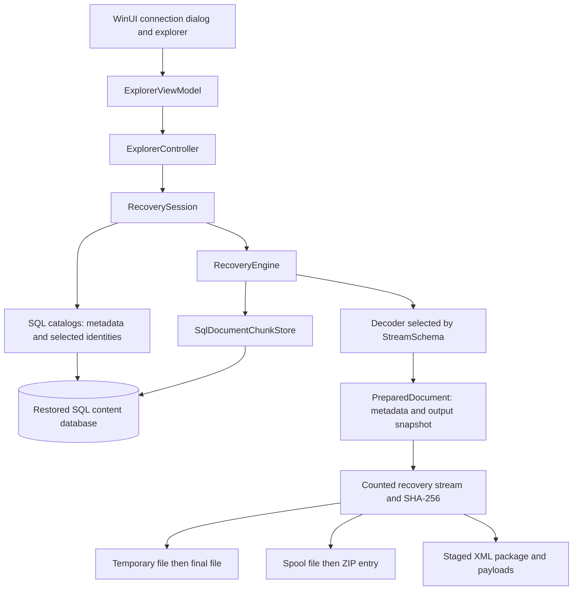

# Architecture and file reconstruction

This document explains how SharePoint Database Explorer reads a restored content database and produces local recovery artifacts. The application uses SQL queries and its own format readers. It does not require a SharePoint farm or SharePoint server assemblies to browse or export the supported resident content.

The supported source generations are SharePoint Server 2016, SharePoint Server 2019, and SharePoint Server Subscription Edition. Support is checked against both the recorded build and the columns available in the database. A supported generation does not imply that every document storage format or list configuration can be exported.

## Runtime data flow

Responsibilities are separated so that file reconstruction is shared by ordinary file export, document versions, attachments, retained deleted files, ZIP export, and deployment packages.

| Layer | Responsibility | Main sources |
| --- | --- | --- |
| WinUI | Connection, navigation, checkboxes, destination pickers, progress, and completion | [WinUI](../src/WinUI/) |
| Desktop view models | Asynchronous operations, UI dispatch, selection lifetime, and cancellation | [ExplorerViewModel](../src/Desktop/ViewModels/ExplorerViewModel.cs) |
| Desktop controller | Validate requested export scopes, collect results, and write reports | [ExplorerController](../src/Desktop/ExplorerController.cs), [bulk exports](../src/Desktop/ExplorerBulkExports.cs) |
| SQL catalogs | Describe sites, webs, lists, folders, items, files, versions, and deletion identities | [SQL repository](../src/Storage/SqlRepository.cs) and the other files in [Storage](../src/Storage/) |
| Recovery engine | Re-resolve selected identities, read content, choose a decoder, and prepare a recovery snapshot | [RecoveryEngine](../src/Core/RecoveryEngine.cs) |
| Storage readers | Parse resident plain streams and structured shredded storage | [Serialization](../src/Serialization/) |
| Publication | Write files, archives, and validated XML packages without publishing unfinished artifacts | [Export](../src/Export/) |

The view model performs database and export work away from the UI thread and dispatches observable state changes back to the UI. Source and navigation generations prevent stale asynchronous results from replacing a newer connection or location. Changing folders clears the checked file selection. A controller serializes its operations for one session; exports do not run concurrently against the same session.

## Connections and database profiles

[SqlConnectionOptions](../src/Storage/SqlConnectionOptions.cs) starts with empty server and database fields. It supports the current Windows user or a SQL login. Database discovery connects to `master` and lists online databases accessible to the selected account; opening a database then checks its required content schema.

Queries read the restored database. There is no application path that updates content tables or restores objects into a farm. Use a restored database and a login with the required read access. Credentials are held in process memory, not persisted as application settings. The desktop controller redacts the supplied password from errors that it presents or records. Reports still intentionally contain source names, document identities, paths, and export results.

The current connection defaults enable encryption and trust the server certificate. These are distinct options: certificate trust bypasses certificate validation. Users can change both in the connection dialog.

[SqlContentSchema](../src/Storage/SqlContentSchema.cs) reads the database build from `dbo.Versions` and checks optional size and external-storage columns. It selects only columns that exist. Logical file size prefers `SizeRead`, then `Size`, then `SizeWrite` where those columns are available. [SharePointBuilds](../src/Core/SharePointBuilds.cs) rejects SharePoint 2013 and earlier, unrecognized builds, and unsupported generations.

## Metadata and exact source identities

A [Node](../src/Core/Models.cs) carries both its navigation role and the identities needed for recovery. A path or filename is a display value, not sufficient evidence that a returned row is the selected object.

The recovery engine resolves metadata again before reading and validates the result against the requested operation:

- **Current file:** the site and document identity must still describe an active current file. A library export also checks web and list membership.
- **Document version:** the site, document, web, list, UI version, history key, publishing level, and internal version must match the selected retained version. The current version uses history key `0`; a historical `AllDocVersions.UIVersion` is the `DocsToStreams.HistVersion` key. `InternalVersion` is a separate counter and is not substituted for that key.
- **Attachment:** the file must remain attached to the selected ordinary list item, including the owner's document identity, list item ID, and unique item ID.
- **Deleted content:** the binary deletion transaction is part of the identity. Deleted rows are queried through a separate catalog. After reading streams, the engine resolves the deleted metadata again to detect restoration, purging, or changed metadata. It does not fall back to an active document.

A historical version's name and path come from its active document because the historical metadata table does not retain those columns. The version's size, schema, level, timestamp, and counters come from its historical row. The displayed current location therefore does not prove the document had that location when the version was created.

There is no database-wide transactional snapshot for an export. Identity checks, selected metadata checks, and package snapshot comparisons reduce substitution risks, but they are not a substitute for a stable restored source.

See [version catalog](../src/Storage/SqlVersionCatalog.cs), [deleted catalog](../src/Storage/SqlDeletedCatalog.cs), and [attachment catalog](../src/Storage/SqlAttachmentCatalog.cs).

## Reading physical SQL chunks

[SqlDocumentChunkStore](../src/Storage/SqlDocumentChunkStore.cs) joins `DocsToStreams` to `DocStreams` for the selected site, document, history key, publishing level, and primary partition `0`. It returns descriptors containing the SQL BSN, stream ID, partition, type, and resident byte buffer.

Each resident buffer must have the size recorded on its `DocStreams` row and fit in a managed byte array. Missing joined rows, truncated content, invalid sizes, and unavailable content are reported rather than replaced with invented bytes. Rows are delivered without an `ORDER BY`; their SQL BSN is not a reconstruction sequence number.

External references are distinct from resident object-data BLOBs inside a shredded store. A nonempty `RbsId`, or an external ABS reference with no resident payload, requires an external provider that this application does not implement. An empty `RbsId` is treated as absent. Where ABS compression metadata is present alongside an exact-size resident payload, those resident bytes are kept as their original representation. The reader does not guess a compression codec from `CompressedSize`. Compression metadata without its ABS context is rejected.

A SharePoint template or ghosted file can have metadata with `HasStream=false` and no resident bytes. Such a record cannot produce a standalone file from the database alone. This is determined by content metadata, not by the `.aspx` extension: a customized page with supported stored content can still be exported.

## Choosing a document decoder

`AllDocs.StreamSchema` is treated as a bit field. It combines file layout, cell layout, and host tagging; undefined or reserved combinations are rejected by [DocumentDecoders](../src/Serialization/DocumentDecoders.cs).

| StreamSchema values | Reader | Current behavior |
| --- | --- | --- |
| `0`, `1`, `64`, `65` | Resident plain stream | Requires one supported resident inline buffer with exactly the logical file length; an empty file can have no buffers |
| `2`, `66` | Generic shredded document | Parses the stored tree and writes its reachable leaf buffers in tree order |
| `18`, `82` | OneNote server section | Reconstructs the supported server packaging representation |
| `34`, `98` | OneNote server notebook index | Reconstructs the supported server packaging representation for the table of contents |
| Other values | No registered reader | Unsupported; no document bytes are fabricated |

The generic reader is independent of extension. It can reconstruct document, image, text, and other file types when they use a supported storage layout. It does not regenerate Office documents or infer their contents from application metadata.

## Persisted shredded-storage parsing

[PersistedStorage](../src/Serialization/PersistedStorage.cs) reads the actual wrapper structure: elements, length-prefixed items, child records, footers, and the signature of a data-element blob. It never searches opaque property or file data for marker bytes to guess where records begin.

Identifiers can be full or compressed extended GUIDs. GUID tables map compressed table indices to GUIDs; later entries at the same index replace earlier entries. A host's active table applies to its contained records. The first table encountered is also available to later rows that do not declare one. Data-element tables are structurally read, while identifiers in those elements resolve against the host table.

[ShreddedStore](../src/Serialization/ShreddedStore.cs) reads the first primary-partition row with `StreamId=1` first, then all non-main primary-partition rows in the order supplied. Additional main rows are ignored. Parsed records include storage indexes, storage manifests, cell manifests, revision manifests, object groups, fragmented groups, partial objects, and object-data BLOB fragments.

Structural damage ends processing of the damaged row's remainder. Records parsed before that damage remain available, a warning is logged, and processing continues with the next row. [RecoveryLog](../src/Core/RecoveryLog.cs) appends these diagnostics to a daily file under `%LOCALAPPDATA%\SharePointExplorer\Logs`; log-writing failure does not fail recovery. This does not guarantee that a damaged file is recoverable: a required missing root, object, or range still prevents recovery. Deprecated layouts and other unsupported formats are separate from recoverable structural damage.

The parser deliberately does not enforce every duplicated identity, trailing field, or declared value constraint in the persisted wrapper. Its structural checks should not be interpreted as complete validation of the database's original content.

## Generic object graph reconstruction

Generic documents are assembled by [GenericDocumentStore](../src/Serialization/GenericDocumentStore.cs) and [StoredDocumentReader](../src/Serialization/StoredDocumentReader.cs). They use the following state rules; sorting SQL chunks by BSN and concatenating their `Content` columns would not produce the document.

### Root and traversal

The last processed revision declaring the primary file root chooses that root. Storage index entries and revision basis links do not replace this rule for generic files.

Traversal follows serialized references depth first. Referenced node order determines output order. A node takes precedence over leaf data with the same identity, even if the leaf has a newer sequence. Cycles, repeated consumption of a leaf, missing objects, and traversal beyond the fixed visit budget fail recovery.

### Independent node and leaf state

Inline records containing references update the node dictionary. Inline records without references update the leaf dictionary. A partial object always updates leaf state, even when its header contains references. The two dictionaries have independent sequence thresholds.

Sequences come from the embedded contained blob, not its SQL BSN. Direct object-data BLOB fragments use the embedded serial's sequential value. An inline update replaces existing state of its own kind only when its sequence is strictly greater; ties retain the earlier parsed value.

For a leaf created by a partial fragment, that first fragment establishes the threshold. Further fragments at or above that threshold are accepted and appended. Accepting a fragment does not advance an existing threshold. A later accepted inline record can raise the threshold, but it retains accumulated fragments; those fragments remain the preferred representation when reading the leaf.

### Joining accepted fragments

Fragments are grouped by their start offset and sorted by that offset. The last accepted fragment at an identical offset wins. Each distinct offset contributes its complete byte buffer. Overlap is not trimmed and is not compared for equality in the generic reader.

For example, accepted buffers `ABCD` at offset `0` and `XY` at offset `2` produce `ABCDXY`. This illustrates the implemented sequence of output buffers; it is not ordinary random-access patching of a byte array. A fragment whose start is beyond the cumulative number of output bytes is a missing range and prevents recovery. Generic reconstruction does not use a fragment's declared object size as an output boundary.

A resident object-data BLOB reference can supply an object through its object-to-BLOB mapping only when no inline or partial leaf state exists for that object. Direct BLOB pieces are also registered as fragment state at their `FragmentOf` identity. This support reads bytes already present in the database; it does not recover an external RBS or ABS store.

### Length and hash semantics

The generic decoder freezes the ordered output segments and measures their total length before publishing. That measured length is the limit checked while writing the result. It is not compared with the logical size recorded in SQL, and stored node sizes or stored leaf hashes are not used to authenticate its reconstructed bytes.

[HashingWriteStream](../src/Core/HashingWriteStream.cs) computes the SHA-256 of bytes actually written and checks the prepared output limit. The resulting digest is useful for identifying or comparing exported artifacts. Without an independent original digest, it is not proof that those bytes match an original source file. The plain reader has a different contract: its resident payload must exactly match the logical file size.

## OneNote reconstruction is a separate format

[OneNoteDocumentReader](../src/Serialization/OneNoteDocumentReader.cs) expands supported SharePoint storage into the MS-ONESTORE section 2.8 server packaging format. It preserves supported object data, references, partitions, cells, manifests, and inherited revisions and writes synthesized package identities deterministically from the serialized state.

This path validates a OneNote graph and uses a separate object-group assembler. Its partial objects must cover their declared size, fit that size, and have identical overlapping bytes. These checks must not be described as the generic reader's fragment rules.

OneNote object-data BLOB states that require a BLOB-preserving package serializer are rejected. Whole-notebook `.onepkg` export is not implemented. The reconstructed server packaging is not claimed to be an identical copy of an original desktop `.one` or `.onetoc2` file, and compatibility with every OneNote client and storage layout has not been established.

## File publication, ZIPs, and reports

A [PreparedDocument](../src/Core/RecoveryEngine.cs) retains the resolved metadata, chunk buffers, and, where applicable, frozen reconstruction segments. All exporters use this prepared content so that the identity being checked and the bytes being written belong to the same prepared operation.

### Local files

[DocumentExporter](../src/Export/DocumentExporter.cs) sanitizes invalid filename characters, trailing dots and spaces, and reserved Windows device names. Existing files and directories cause a numbered alternate filename instead of an overwrite. Recovery writes a uniquely named `.partial` file in the destination, checks output length, flushes it, sets the available modification timestamp, and moves it to its final name. Failure removes the owned temporary file.

Selected ordinary files are exported to the chosen directory. Library export and version recovery preserve a sanitized source hierarchy beneath the site identity. Version filenames include the visible version to distinguish retained states. Sanitization and collision suffixes mean output names can differ from source names.

### ZIP exports

[ValidatedZipArchive](../src/Export/ValidatedZipArchive.cs) first recovers each document to a private spool file and validates that recovery's length and hash computation. Only then does it create the document's ZIP entry. This lets a document recovery failure be recorded without starting an incomplete entry.

ZIP paths preserve a sanitized site and source hierarchy. Names are checked case insensitively for file and folder collisions, including the reserved report names. The archive contains `export-report.csv` and `summary.txt` in addition to recovered document entries. Empty source folders are not preserved as explicit empty ZIP directory entries.

The archive is written under a temporary name, closed to finish its ZIP structures, flushed, and moved to an available final filename. An entry-write failure faults the archive and prevents publication. The implementation does not reopen a finished ZIP to read back or rehash its entries.

Cancellation is generally checked between documents. If a ZIP export is cancelled after successful documents, it can publish those completed entries with a cancelled summary. If it is cancelled before any successful document, its temporary archive is discarded. A long SQL read or single document recovery may complete before that cancellation is observed.

### Export reporting and unavailable records

Ordinary and version exports produce CSV reports containing source scope, document identity and path, result status, byte count, SHA-256, destination, and any recovery message. Version and deleted reports add the corresponding state identities. CSV writers quote values and escape embedded quotation marks.

Metadata-only files and unknown storage schemas are filtered before ordinary batch export, so standard unsupported template pages do not become user warnings or inflate discovered export totals. If an eligible document subsequently proves unavailable or unsupported, that result remains in its report; the completion UI focuses on successful exports and real failures. An export total is therefore the number of eligible discovered documents, not the total number of metadata rows in a library.

Files already published before cancellation remain available. A report can contain only the documents processed before cancellation. The report is a recovery record, not a transaction that rolls back successful files.

## Content-deployment XML packages

[MigrationPackageExporter](../src/Export/MigrationPackageExporter.cs) exports one current list or library to an uncompressed package directory using the MS-PRIMEPF deployment structure. The package includes:

- `Manifest.xml`, `ExportSettings.xml`, `LookupListMap.xml`, `Requirements.xml`, `RootObjectMap.xml`, `SystemData.xml`, `UserGroup.xml`, and `ViewFormsList.xml`;
- numbered `.dat` payloads containing current file or attachment bytes and, when requested, retained document versions;
- `export-report.csv` and `package-audit.json` with payload recovery details and source metadata needed by package validation.

The catalog reads list settings, fields, supported field values, content types, folders, items, public views, referenced users, and source deployment context. Template files without database bytes can be represented by verified ghosted-file setup references; the package does not supply front-end template file streams. Security export is declared as `None`.

Optional history includes supported retained file versions and corresponding item history. It does not reconstruct purged history. Unsupported compound field serializers, unresolved lookup or user references, incomplete metadata, or required unavailable payloads prevent publication instead of silently producing a package with incomplete claims.

The exporter recovers payloads in a private staging directory, then rereads the selected list metadata, attachment set, and requested history. Changed snapshots fail the operation. Generation-specific deployment compatibility identifiers are separate from the SQL source build; SQL build components are not substituted for deployment `DatabaseVersion`.

Before publishing, the exporter validates all eight XML files against the embedded deployment XSDs described in the [schema documentation](../src/Export/Schemas/README.md). It also checks relationships, identities, parents, view references, declared history coverage, author/editor maps, ghosted-file setup paths, and safe payload references. It rereads payload files to verify their lengths and SHA-256 values against `package-audit.json`, and rejects unreferenced or missing payloads and filesystem redirects.

Only after these checks does it move the complete staging directory to its final package name on the same volume. A failed or cancelled package removes its owned staging directory; it does not publish a partial package.

Schema and relationship validation do not establish that a particular SharePoint farm will accept the package. End-to-end target-farm import compatibility has not been verified. The app does not perform `Import-SPWeb` or restore objects into SharePoint.

## Retained deleted list-item metadata

A deleted ordinary list item can be exported through [DeletedItemExportService](../src/Export/DeletedItemExportService.cs) as a separate `DeletedListItemRecovery` XML document. It records the selected deletion identity, stored field-schema XML, and retained typed storage values. Attachments are separate recoverable documents when their content remains available.

This metadata artifact is not an MS-PRIMEPF deployment package and does not recreate a deleted item in a SharePoint list. Its XML is first written to a temporary file, flushed and hashed, then moved to its final name.

## Limits and extension points

Source data must be restored into SQL Server and readable through the selected login. The application does not open SQL backup files directly, mount snapshots, reconstruct missing database rows, or recover purged content. External BLOB stores, undefined stream schemas, deprecated persisted layouts, some OneNote states, and unsupported deployment field representations remain outside the implemented recovery coverage.

Individual physical buffers must fit in a managed byte array. SQL chunk buffers are held in memory for the selected document, and generic segments retain references to those buffers. OneNote reconstruction also allocates assembled objects and synthesized package output. Large or highly fragmented documents can therefore require substantial memory even when export writes to disk. There is no promise of bounded-memory streaming for arbitrarily large files.

[DocumentDecoderRegistry](../src/Serialization/DocumentDecoders.cs) is the extension point for additional storage layouts. [Core contracts](../src/Core/Contracts.cs) separate catalogs and chunk access from the engine; specialized contracts expose versions, attachments, deleted content, and migration metadata. A new provider or decoder should preserve operation-specific identity validation, clearly define its output-size contract, and remain separate from file publication and UI code.

For build, operation, and release instructions, return to the [README](../README.md). For regression fixtures and integration checks, see [tests](../tests/) and the testing instructions in the README.
